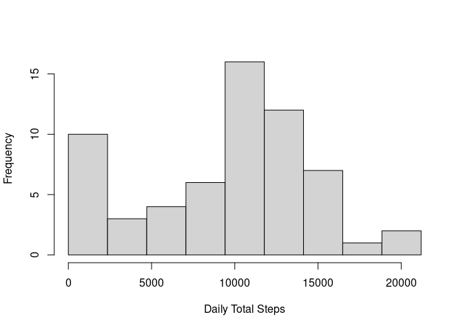
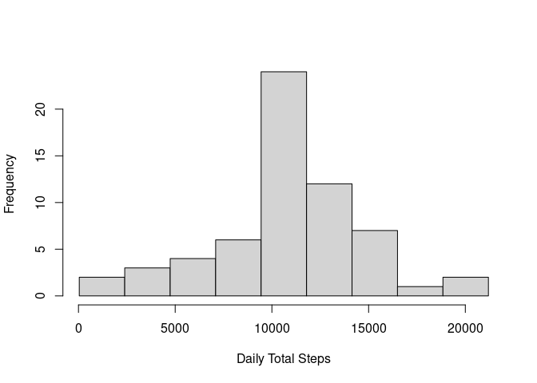
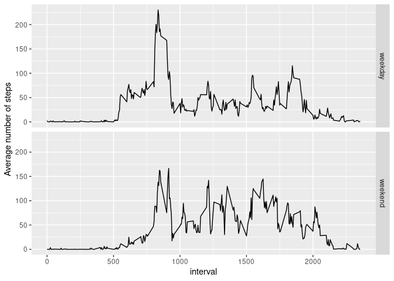

## Loading and preprocessing the data

Read the data from the zip and convert the date column to a valid date format.


```r
library(dplyr)
library(ggplot2)

df <- read.csv(unz("activity.zip", "activity.csv"))
df$date <- as.Date(df$date)
```


## What is mean total number of steps taken per day?

First, we compute daily total number of steps with `tapply`, and then find the mean. We need to pass `na.rm` flag, since the dataset contains NAs. 


```r
daily_total_steps <- tapply(df$steps, df$date, sum, na.rm = TRUE)

# print the histogram with 10 bins
breaks <- seq(min(daily_total_steps), max(daily_total_steps), length.out=10)
hist(daily_total_steps, breaks=breaks, xlab="Daily Total Steps", main=NA)
```

<!-- -->


```r
# print mean and median
mean(daily_total_steps)
```

```
## [1] 9354.23
```

```r
median(daily_total_steps)
```

```
## [1] 10395
```


## What is the average daily activity pattern?

Compute average number of steps for each interval and plot it. 


```r
interval_average_steps <- tapply(df$steps, df$interval, mean, na.rm = TRUE)
plot(names(interval_average_steps), interval_average_steps, type="l", ylab="Average number of steps", xlab="5 minute intervals")
```

<!-- -->

Print the interval with maximum number of steps.

```r
interval_average_steps[which.max(interval_average_steps)]
```

```
##      835 
## 206.1698
```

## Imputing missing values

Find total number of rows with missing values. 


```r
sum(!complete.cases(df))
```

```
## [1] 2304
```

Impute missing values with average values from corresponding intervals. 

```r
impute.mean <- function(x) replace(x, is.na(x), mean(x, na.rm = TRUE))
imputed_df <- df %>% group_by(interval) %>% mutate(steps = impute.mean(steps)) %>% as.data.frame()
```

We then calculate the total steps for each day and plot the histogram as before.

```r
daily_total_steps <- tapply(imputed_df$steps, imputed_df$date, sum, na.rm = TRUE)

# print the histogram with 10 bins
breaks <- seq(min(daily_total_steps), max(daily_total_steps), length.out=10)
hist(daily_total_steps, breaks=breaks, xlab="Daily Total Steps", main=NA)
```

<!-- -->

After imputing the missing values, now the median and mean are greater than before and also the same.


```r
# print mean and median
mean(daily_total_steps)
```

```
## [1] 10766.19
```

```r
median(daily_total_steps)
```

```
## [1] 10766.19
```

## Are there differences in activity patterns between weekdays and weekends?

Create a factor variable `tow` indicating whether it is a weekday or weekend.

```r
imputed_df$tow <- as.factor(ifelse(weekdays(imputed_df$date) %in% c("Saturday", "Sunday"), "weekend", "weekday"))
```

Plot with average number of steps by interval, plot separately for weekedays and weekends. 


```r
 imputed_df %>% group_by (interval, tow) %>% summarise(steps=mean(steps)) %>% ggplot(., aes(x=interval, y=steps)) + geom_line() + ylab("Average number of steps") + facet_grid(rows = vars(tow)) 
```

<!-- -->
